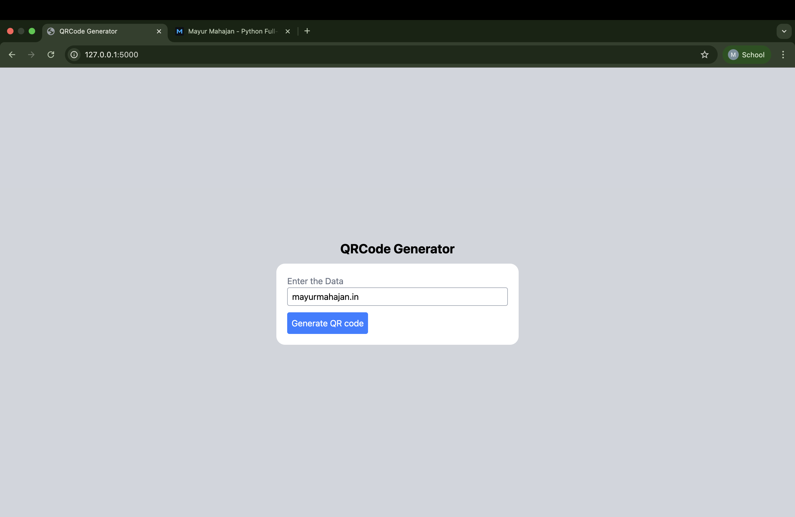
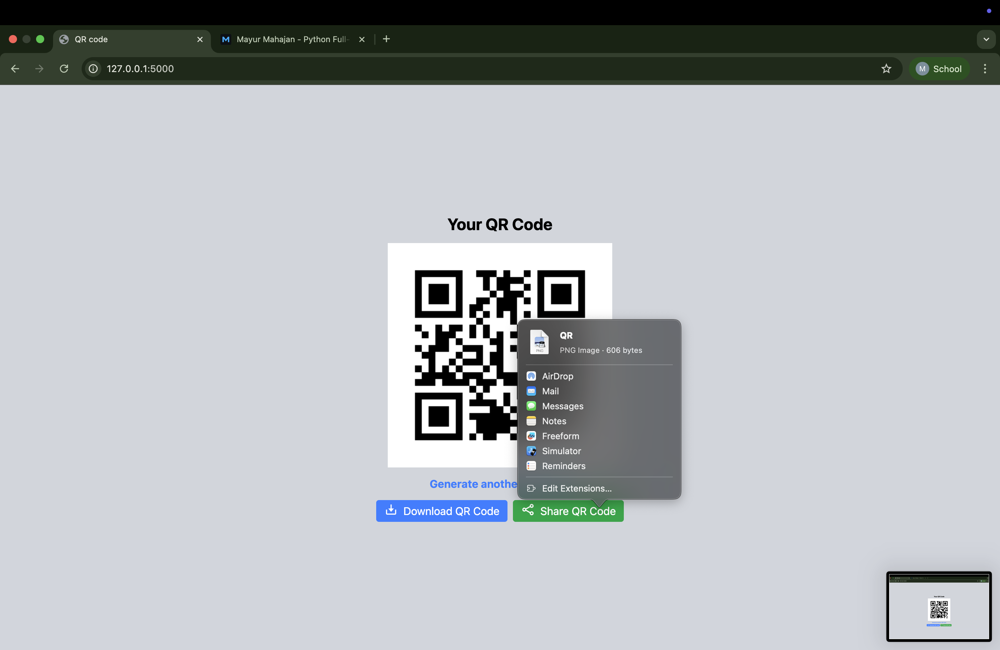

# Flask QR Code Generator

A minimal, elegant **Flask** application to generate QR codes from any text or URL. It lets you preview the QR, **download** it as a PNG, and **share** it using the system share sheet (where supported).

<p align="center">
  
  
</p>

---

## 🚀 Live Demo

👉 Try it here: [https://flask-qr-code-generator-mocha.vercel.app/](https://flask-qr-code-generator-mocha.vercel.app/)

---

## ✨ Features

- 🔳 Generate QR codes for any text/URL
- 👀 Instant preview in the browser
- ⬇️ **Download** PNG file (high-contrast, print-ready)
- 📤 **Share** via the native share sheet (Web Share API on supported devices)
- ♻️ “Generate another” flow for quick repeats
- 🧼 Clean, responsive UI (works great on desktop and mobile)

---

## 🧱 Tech Stack

- **Backend:** Python, Flask
- **QR Generation:** `qrcode` (Pillow backend)
- **Frontend:** HTML, CSS (utility classes), a pinch of vanilla JS
- **Hosting:** [Vercel](https://vercel.com/)

---

## 📦 Project Structure

```
Flask-QR-code-Generator/
├── app.py
├── requirements.txt
├── static/
│   ├── style.css
│   └── (images, icons, etc.)
├── templates/
│   ├── index.html        # Input form
│   └── qrcode.html       # Preview + actions
└── screenshots/
    ├── 01-home.png
    └── 02-generated.png
```

---

## 🚀 Getting Started (Local Setup)

### 1) Clone the repo
```bash
git clone https://github.com/Er-Mayur/Flask-QR-code-Generator.git
cd Flask-QR-code-Generator
```

### 2) Create & activate a virtual environment
```bash
# macOS / Linux
python3 -m venv .venv
source .venv/bin/activate

# Windows (PowerShell)
py -m venv .venv
.venv\Scripts\Activate.ps1
```

### 3) Install dependencies
```bash
pip install -r requirements.txt
```
If you don’t have a `requirements.txt` yet, this usually works:
```bash
pip install flask qrcode[pil] pillow
pip freeze > requirements.txt
```

### 4) Run the app
```bash
# Option A
python app.py

# Option B
export FLASK_APP=app.py            # set FLASK_APP on Windows: set FLASK_APP=app.py
flask run --reload
```
Open your browser at **http://127.0.0.1:5000**.

---

## 🧪 Usage

1. Enter any **URL** or **text** into the input.
2. Click **Generate QR code**.
3. On the result page:
   - Click **Download QR Code** to save a **PNG**.
   - Click **Share QR Code** to open the **system share sheet** (mobile Safari/Chrome, macOS share menu, etc.).
   - Click **Generate another QR Code** to go back quickly.

> Tip: Most phone cameras can scan the QR directly from your screen.

---


## 🙌 Acknowledgements

- Built with ❤️ using **Flask** and **qrcode**.
- Thanks to everyone who reports issues, improves styling, or adds ideas.

---
